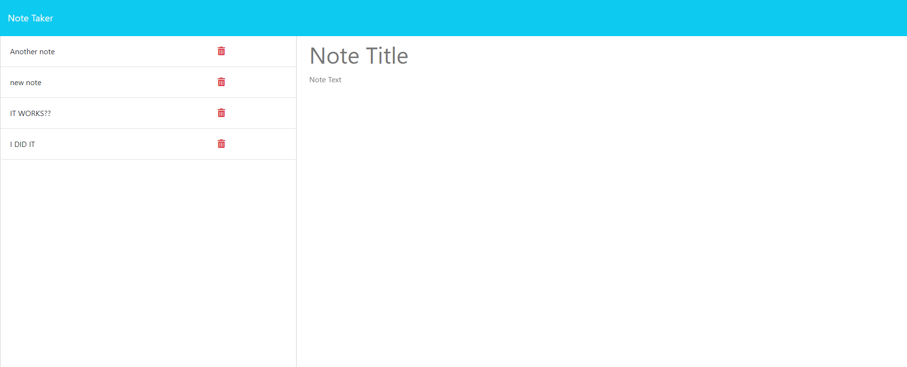

# note-taker

## Description
This is an app which allows you to write and save notes with a title and body text.

## Installation
Run npm i in the command line to install all dependencies.

## Usage
Click get started button to go to the note taking page. Click on 'Note Title' to begin typing the title for your note. Click on 'Note Text' to begin typing the main content of your note. When done, click on the 'Save Note' button in the top right of the page to save your note. Click on any note in the left side bar to display it in the main area of the webpage. 

## Credits
Ethan Stone and UCLA Bootcamp

## License
N/A